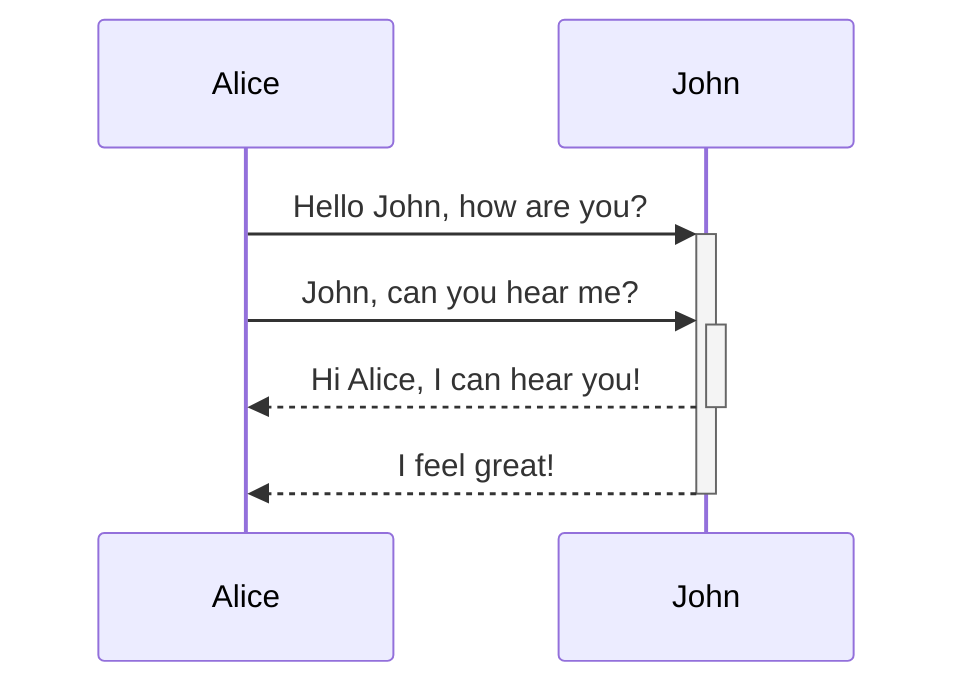

[swimm-ui/swimm-ui/Emiliya's Onboarding](https://app.swimm.io/repos/pw8tVz0TAgLaoHABDlsw/playlists/2d8iu)

[swimm-ui/swimm-ui/Using The Library](https://app.swimm.io/repos/pw8tVz0TAgLaoHABDlsw/docs/bc324)

 

<!--MERMAID {width:50}-->

<!--MCONTENT {content: "sequenceDiagram \nAlice->>+John: Hello John, how are you? \nAlice->>+John: John, can you hear me? \nJohn\\-\\-\\>>-Alice: Hi Alice, I can hear you! \nJohn\\-\\-\\>>-Alice: I feel great! \n\n "} --->

 

[<--VIDEO-->](https://www.youtube.com/watch?v=S7oYPFlh_M4)

 

 

 

 

This file was generated by Swimm. [Click here to view it in the app](https://app.swimm.io/repos/Z2l0aHViJTNBJTNBeWd3aWZpJTNBJTNBUnlhemJlY2s=/docs/x6jrpuow).
